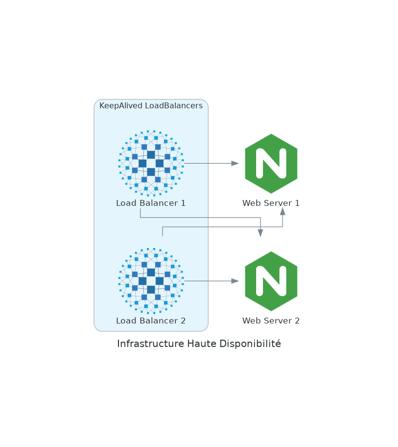

# Haute disponibilité

- [Haute disponibilité](#haute-disponibilité)
  - [Pré-requis](#pré-requis)
    - [Vagrant](#vagrant)
    - [Ansible](#ansible)
  - [Utilisation](#utilisation)
  - [Explications](#explications)
    - [Infrastructure](#infrastructure)
    - [Fichiers configuration](#fichiers-configuration)


## Pré-requis

### Vagrant
L'infrastructure est composée de VM générer par **Vagrant**, voici la [documentation de l'installation](https://developer.hashicorp.com/vagrant/downloads)


### Ansible
Les serveurs sont configurés grâce à **Ansible**, voici la [documentation de l'installation](https://docs.ansible.com/ansible/latest/installation_guide/intro_installation.html)

## Utilisation
Configurer l'infrastructure :
- Configurer les VM dans le fichier `config.yaml`
- Editer l'infrastructure grâce au fichier `ansible/inventory` (qui sert à la fois à Ansible pour configurer les serveurs et aussi à Vagrant pour générer l'infrastructure)

Lancer les VM
```
vagrant up
```

Configurer les serveurs (lance le playbook `ansible/main.yml` qui va faire appel aux autres playbook situés dans le dossier `ansible/playbook`)
```
ansible-playbook -i ansible/inventory -D ansible/main.yml
```

Vous pouvez voir le résultat sur votre navigateur WEB à l'adresse indiquée dans le fichier `ansible/res/keepalived.conf` (par défaut http://192.168.60.100)

## Explications

### Infrastructure

Tout d'abord on créer les VM grâce à **Vagrant**, ensuite on utilise **Ansible** pour installer les paquets et configurer les machines virtuelles. Pour les serveurs WEB on utilse **NGINX** avec un fichier HTML de base indiquant sur quel serveur nous nous trouvons. Côté Load Balancer c'est **HAProxy** qui est utilisé pour rediriger ensuite sur les deux serveurs WEB. Enfin une Virtual IP avec **KeepAlived** pour de la haute disponibilité.



### Fichiers configuration

- `ansible/res/index.html` : Fichier html afficher sur les serveurs WEB
- `ansible/res/haproxy.cfg` : Fichier de configuration de HAProxy sur les loadbalancers
- `ansible/res/keepalived` : Fichier de configuration de keepalived (virtual IP) sur les loadbalancers

Pour le serveur de cache il faut
- `apt-get update && apt-get install git autotools-dev automake libevent-dev liblua5.3-dev build-essential -y`
- `sed -i -e "s/# fr_FR.UTF-8.*/fr_FR.UTF-8 UTF-8/" /etc/locale.gen`
- `dpkg-reconfigure --frontend=noninteractive locales`
- `update-locale LANG=fr_FR.UTF-8`
- Installer le git de la branche next de memcached ([tuto](https://github.com/memcached/memcached/wiki/Proxy)) `git clone https://github.com/memcached/memcached.git`
- `cd memcached && git checkout next`
- `export ACLOCAL_PATH=/usr/share/aclocal`
- `./autogen.sh`
- `cd vendor && ./fetch.sh && cd ..`
- `./configure --enable-proxy`
- `make`
- `make test`
- `cd .. && git clone https://github.com/memcached/memcached-proxylibs`
- `nano memcached/example.lua`
```
local s = require("simple")

-- by default, sends "/foo/*" to "foo" and "/bar/*" to "bar"
pool{
    name = "foo",
    backends = {"127.0.0.1:11212"},
}
```
- `LUA_PATH=/home/vagrant/memcached-proxylibs/lib/simple.lua ./memcached -o proxy_config=./example.lua -u vagrant`